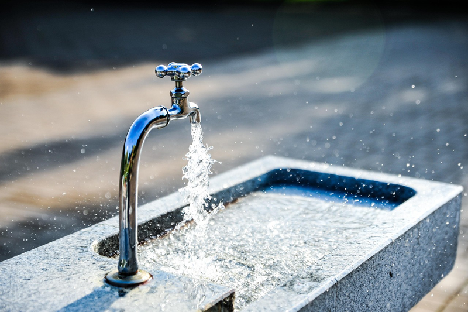
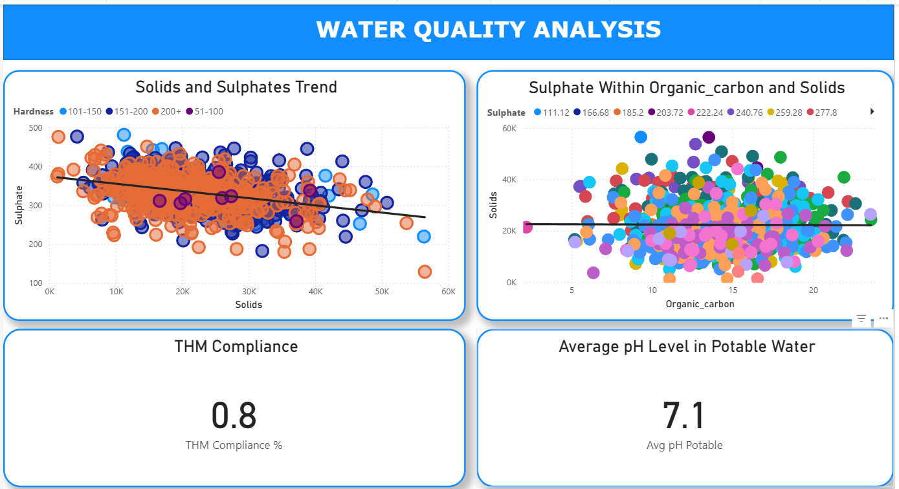

# 

# Project Water Quality Analysis

## Introduction
The purpose of this project is to understand the water quality and how such concentrations of substances and elements impact on humans' ability to consume for the benefit of our health. Various water companies are investing in water infrastructure, such as sanitation, as it generates economic benefits for the respective regions. A cost-benefit analysis would suggest in this case that the benefit of the reduction in disease and health care costs outweighs the cost of water infrastructure. This is because societies as a whole benefit from sanitation interventions. In addition, it is very interesting when we think of the journey water takes from its source in the hills or mountains, reservoirs, and sanitation plants, then to our taps in our homes. 

## Dataset Content
* About the dataset
The dataset has been obtained from the Kaggle website and contains water quality metrics for 3276 water bodies. Therefore, it provides sufficient scope to understand whether the water quality meets the World Health Organization's standards. The WHO and UK standards will be the benchmarks for us to measure and comment on the water quality. The dataset is a csv file and is 512kb in size with 10 columns.

## Water Quality Dataset Parameters and Definitions

#### pH
Definition: Measures the acidity or alkalinity of water on a scale from 0 to 14. Values below 7 indicate acidic water, while values above 7 indicate alkaline water.

#### Hardness
Definition: Indicates the concentration of calcium and magnesium salts in water. Higher values suggest "hard" water, which can cause scaling in pipes and affect soap efficiency.

#### Solids
Definition: Represents the total dissolved solids (TDS) in water, including minerals, salts, and metals. High TDS levels can affect taste and may indicate contamination.

#### Chloramines
Definition: Chemical compounds formed by combining chlorine with ammonia. Used as disinfectants in water treatment but can be harmful at high concentrations.

#### Sulphates
Definition: A naturally occurring compound in water, often from dissolved minerals. High sulfate levels can cause a bitter taste and laxative effects.

#### Conductivity
Definition: Measures the water's ability to conduct electricity, which correlates with the concentration of dissolved ions. Higher conductivity indicates higher ion concentration.

#### Organic Carbon
Definition: Represents the amount of carbon found in organic compounds in water. High levels can indicate pollution from organic matter.

#### Trihalomethanes (THMs)
Definition: Chemical compounds formed when chlorine used in water treatment reacts with natural organic matter. Some THMs are carcinogenic.

#### Turbidity
Definition: Measures the cloudiness or haziness of water caused by large numbers of individual particles. High turbidity can harbor microorganisms and indicate poor water quality.

#### Potability
Definition: The target variable indicating whether the water is safe for human consumption. A value of 1 means potable (safe), and 0 means not potable (unsafe).

### The table below outlines the measurements, substances,solids and elements that come to be found in the water source. The UK's and World Health Organisation's standards indicates what is acceptable for human consumption.

| Water Elements      | Description                                                                                                                         | WHO Standard / Cause                                                      | UK Standard / Cause                                                                 |
|--------------------|-------------------------------------------------------------------------------------------------------------------------------------|---------------------------------------------------------------------------|------------------------------------------------------------------------------------|
| pH value           | Measures the acidity or alkalinity of the water.                                                                                   | WHO: 6.5–8.5 (recommended range for palatability).                        | UK: Legal minimum 6.5 and maximum 9.5 at the tap.                                  |
| Hardness           | Calcium & magnesium salts. The longer the water is in contact with these salts, the harder the water.                               | WHO: No health-based guideline (aesthetic range: 50–500 mg/L as CaCO₃).  | UK: No legal limit (monitored for operational/aesthetic reasons).                  |
| Solids (TDS)       | Water can dissolve inorganic and organic minerals or salts. This can result in an unwanted taste and appearance of water.          | WHO: Desirable ≤500 mg/L; up to 1000 mg/L acceptable.                     | UK: Not specifically regulated; conductivity used as an indicator.                 |
| Chloramines / Free Chlorine | Used to disinfect public water systems.                                                                                   | WHO: ≤5 mg/L for chlorine; chloramine ≤3 mg/L (safe levels).               | UK: No parametric value; operational targets aim for ≤0.5 mg/L at consumers’ taps.|
| Sulphates           | Natural substances found in minerals, soil, and rocks. Also in ambient air, groundwater, plants, and food. Higher concentrations are found in some geographic locations. | WHO: Health-based guideline not required; taste effects above 250–500 mg/L. | UK: Maximum 250 mg/L.                                                              |
| Conductivity       | Pure water is not a good conductor of electric current but rather a good insulator. An increase in ion concentration enhances the electrical conductivity of water. | WHO: Not a health parameter (varies by source).                            | UK: Max 2,500 µS/cm at 20 °C.                                                     |
| Organic carbon (TOC)| Total Organic Carbon in source waters comes from decaying natural organic matter (NOM) as well as synthetic sources.               | WHO: No numeric guideline; monitor to control THMs and taste/odor.         | UK: Indicator parameter—no fixed limit; utilities must monitor TOC removal.       |
| Trihalomethanes (Total THMs) | THMs are chemicals that may be found in water treated with chlorine. Levels vary based on organic material, chlorine used, and water temperature. | WHO: 100 µg/L (as total THMs).                                            | UK: 100 µg/L (sum of chloroform, bromoform, bromodichloromethane, dibromochloromethane). |
| Turbidity          | Depends on the quantity of suspended solid matter. It measures the light-emitting properties of water and indicates waste discharge quality regarding colloidal matter. | WHO: ≤5 NTU, but aim for <1 NTU.                                         | UK: ≤4 NTU (legal), operational aim <1 NTU.                                        |
| Potability         | Indicates if water is safe for human consumption.                                                                                  | WHO: Potable if it meets all parameters.                                   | UK: Potable if compliant with regulations; in datasets: 1 = potable, 0 = non-potable. |

## Business Requirements
#### Purpose and Scope
* Objective: To assess and classify water samples as potable (safe to drink) or non-potable based on chemical and physical parameters.
* Scope: Applies to regional water utility companies, environmental agencies, or research institutions monitoring water quality.

## Hypothesis and validation

#### The hypotheses will be tested using the Shapiro-Wilk,Chi-square (χ²), and t-tests.

#### Ph levels
* Null hypothesis (H₀): There is no difference in pH between potable and non-potable water.
* Alternative hypothesis (H₁): Potable water has a higher average pH than non-potable water.
#### Chloramine levels 
* Null hypothesis (H₀): There is no difference in Chloramine levels between potable and non-potable water.
* Alternative hypothesis (H₁): Potable water has higher Chloramines concentrations on average than non-potable water.
#### Turbidity
* Null Hypothesis (H₀): There is no difference in turbidity between potable and non-potable samples.
* Alternative Hypothesis (H₁): Potable water has lower turbidity on average than non-potable water.

## Project Plan

* Objective: Analyze water quality parameters to identify factors affecting potability and build insights for decision-making.

* Dataset: water_potability.csv (3,276 records, 9 water quality parameters + potability label).

* Deliverables: Clean dataset, exploratory analysis, hypothesis testing, predictive, and final report.

**Project plan phases**

| Phase                      | Duration     |
|---------------------------|--------------|
| Planning & Setup          | 1 week       |
| Data Cleaning & Processing| 1–2 weeks    |
| EDA & Hypothesis Testing  | 2 weeks      |
| Interpretation & Reporting| 1 week       |

### Phase 1: Planning

**Research questions**

* To what extent do the pH levels affect the potability of the water?

* Do the solids that exist contain a level that is suitable for human consumption?

* What is the level of water hardness that contains calcium and magnesium salts?

* Do the levels of sulfates meet the Water Supply (Water Quality) Regulations 2016 and European and World Health  Organization standards of 250 mg/l (milligrams per litre)?

* Are the levels of trihalomethanes safe? Do they exceed 80ppm? 
* What are the turbidity levels in water? Do they meet the WHO value of 5.00?
* How potable is the water, and is it suitable for human consumption?

### Phase 2: Data Management
 
* Data Collection & Integrity Check
The dataset was obtained from the Kaggle website.

* Verify dataset format
The dataset is in a CSV format and 512kb in size with 10 columns

* Data Cleaning & Preprocessing
The dataset was cleaned within a Jupyter notebook, where a description and number of missing values was obtained. The null values were dropped and dataset was readied for analysis.

### Phase 3: Exploratory Data Analysis (EDA)
* Generate summary statistics (mean, median, standard deviation).
* Visualize distributions (histograms, boxplots) and relationships (heatmaps, scatterplots).
* Explore correlations between variables and potability.

### Phase 4: Hypothesis Testing
* Perform statistical tests:
* Interpret p-values to accept/reject hypotheses.
* Document results with tables and plots.

### Phase 5: Interpretation & Reporting
* Summarize findings, highlighting key variables influencing potability.
* Include actionable insights for water quality monitoring.

## The rationale to map the business requirements to the Data Visualisations

* To find out how much water is potable.
* To measure the pH levels in the water.
* To identify the turbidity levels in the water.
* To measure the conductivity of the water.
* To measure the levels of organic carbon.

## Analysis techniques used
* Data Analysis Methods:

* Exploratory Data Analysis (EDA): Used to understand the distribution, relationships, and missing values in the dataset. Visualizations included histograms, boxplots, and correlation heatmaps.
* Limitations: EDA is descriptive and doesn’t provide predictive insights. It may also overlook subtle patterns in high-dimensional data.

#### Data Analysis Structure

* Data Cleaning: Removed duplicates, handled missing values, and ensured proper data types.

* EDA: Visualized distributions, correlations, and outliers.

* Feature Engineering: Normalized or scaled numeric features and explored interactions between variables.

### Data Limitations & Alternative Approaches

* The dataset had missing values and imbalanced classes, which could skew model performance.

### Generative AI Tools

* Used ChatGPT to brainstorm feature engineering ideas, optimize Python code, and validate modeling logic.

* AI-assisted ideation helped identify alternative approaches for missing data imputation and ensemble modeling strategies.

## Ethical considerations
Data Privacy, Bias, and Fairness:

* The dataset contains environmental measurements without personal information, so privacy concerns were minimal.

* Bias could arise from underrepresented water quality conditions or regional variations, affecting model fairness.

## Dashboard Design
The dashboard consists of two pages. On the first page there are two scatterplots and two cards. The second page consists of a Q & A feature, so the user can ask any question and drill down into the dataset. The two other visuals are scatterplots, which show the amount of a given substance when compared to two other substances.

## Development Roadmap
* The main challenges were understanding some of the parameters to really understand how they affected drinking water. 
* The dataset was limited in that some trend analysis could not be shown to reveal major upward or downward trends.

## Main Data Analysis Libraries

| **Library**   | **Usage** |
|----------------|------------------|
| **pandas**     | *Data Cleaning*   `import pandas as pd`   `df = pd.read_csv('water_potability_cleaned.csv')` – Load data   `df.dropna(inplace=True)` – Remove missing values   `df['pH'] = df['pH'].fillna(df['pH'].median())` – Fill missing values |
| **seaborn**    | *Bar Chart*   `import seaborn as sns`   `sns.barplot(x='Potability', y='Hardness', data=df)` – Bar plot   *Boxplot*   `sns.boxplot(x='Potability', y='pH', data=df)` – Box plot   *Histogram*   `sns.histplot(df['pH'], bins=20)` – Histogram |
| **matplotlib** | *Pie Chart*   `import matplotlib.pyplot as plt`   `sizes = df['Potability'].value_counts()`   `plt.pie(sizes, labels=sizes.index, autopct='%1.1f%%')`   `plt.show()` – Pie chart |
| **plotly**     | *Doughnut Chart*   `import plotly.express as px`   `fig = px.pie(df, names='Potability', hole=0.4)` – Doughnut chart   *Histogram*   `fig = px.histogram(df, x='pH', nbins=20)` – Histogram   *Boxplot*   `fig = px.box(df, x='Potability', y='Hardness')` – Box plot   `fig.show()` – Display interactive plots |

## Credits 

* Kaggle - Water Quality Dataset
* ChatGPT - definitions on some parameters & Power BI visuals
* Pandas documentation
* Pixabay - royalty free image

